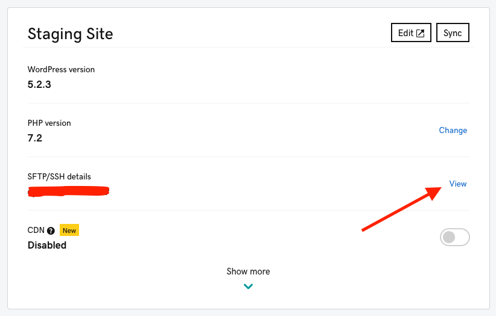

# thewaterdesk
Repository for waterdesk.org

## What is a child theme?
A child theme allows you to change small aspects of your site’s appearance yet still preserve your theme’s look and functionality. To understand how child themes work it is first important to understand the relationship between parent and child themes.

A parent theme is a complete theme which includes all of the required WordPress template files and assets for the theme to work. All themes – excluding child themes – are considered parent themes.

A child theme inherits the look and feel of the parent theme and all of its functions, but can be used to make modifications to any part of the theme. In this way, customizations are kept separate from the parent theme’s files. Using a child theme lets you upgrade the parent theme without affecting the customizations you’ve made to your site.

Any change that you would like to make to your theme should be made inside of your child theme.

The WordPress Developer docs have a lot of [useful information about the do's and don'ts of child themes](https://developer.wordpress.org/themes/advanced-topics/child-themes/).

## Keeping track of changes in your child theme
When you go to make changes to your child theme, we recommend creating a new Git branch to make your changes in. Make sure to name your new branch with a name that is relevant to whatever you are changing inside of the theme.

Once you have finished working on your changes, commit them to your new branch and push them to GitHub. Once they're pushed, we recommend creating a pull request to merge the changes into your master branch. 

Pull requests let you tell others about changes you've pushed to a branch in a repository on GitHub. Once a pull request is opened, you can discuss and review the potential changes with collaborators and add follow-up commits before your changes are merged into the base branch. We've put together a great guide on [how to create a successful pull request](https://github.com/INN/docs/blob/master/how-to-work-with-us/pull-requests.md).

## Deploying updates
Once you have successfully merged and closed a pull request with changes into your master branch, you can go ahead and deploy it to your staging environment.

Unfortunately, GoDaddy Managed WordPress hosting does not support automated deploys, so you will need to deploy changes manually via SFTP.

To start, stash any current changes you have made locally and then checkout and pull the latest version of your master branch.

Once you have a fresh copy of your master branch, you can go ahead and log into your staging server with your SFTP client of choice. You can find your SFTP login information inside of your GoDaddy settings page for the waterdesk.org install. 

Once you are logged into your staging site server, navigate to the `wp-content/themes/` directory. Go ahead and replace the `Newspaper-child` directory with the fresh version of the directory that you just pulled from the master branch. You can also just replace individual files that have been modified if you prefer.

After you've verified that your changes look and function as expected on your staging environment, you can follow the same process to deploy the changes to your production environment.